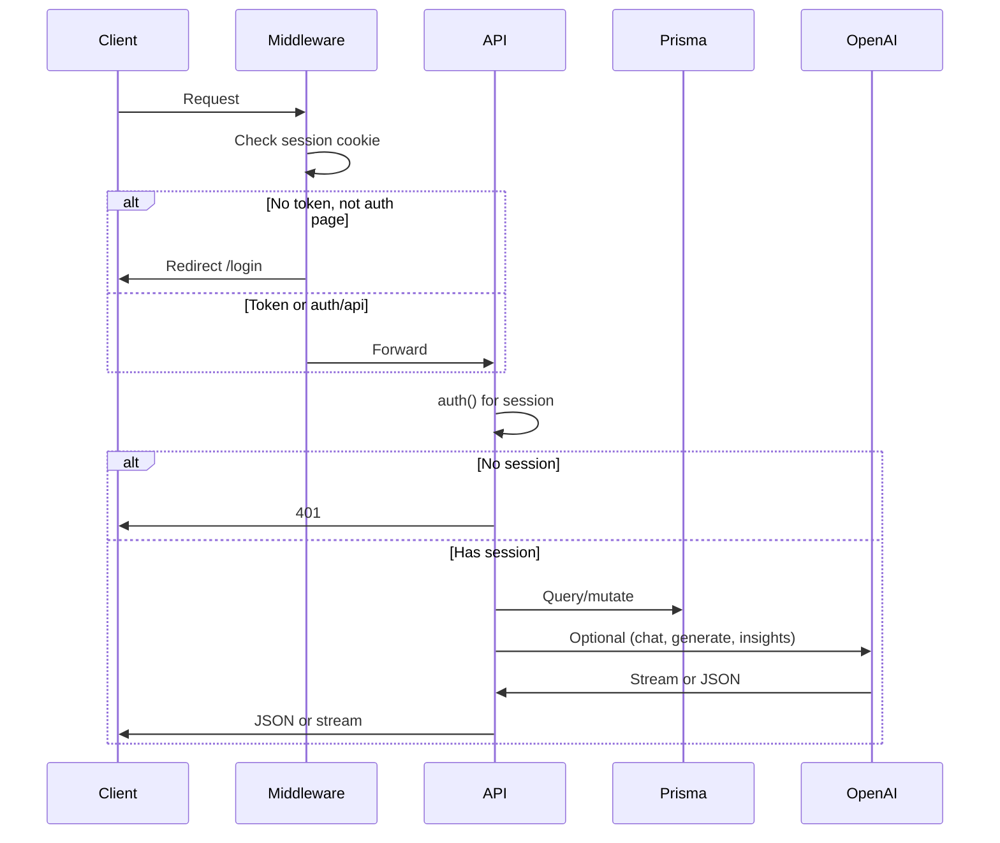
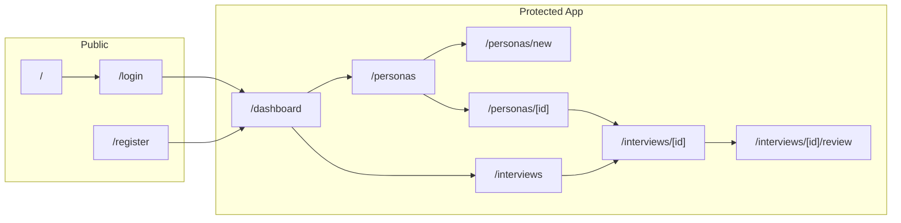

# Architecture

## Overview

PM-Synthetic is a Next.js 16 App Router application. Authenticated users create PM personas (from templates, manually, or via AI), start interviews with them, conduct real-time streaming chat, and export conversations. All app API routes require a valid session; auth is JWT-based via NextAuth 5 (credentials provider).

## Tech Stack

| Layer | Technology |
|-------|------------|
| Framework | Next.js 16 (App Router, Turbopack) |
| Language | TypeScript |
| Database | SQLite via Prisma 6 |
| Auth | NextAuth 5 beta (credentials, JWT session) |
| AI | Vercel AI SDK v6 (`ai`, `@ai-sdk/openai`, `@ai-sdk/react`), OpenAI GPT-4o |
| Styling | Tailwind CSS v4 (CSS variables for theming) |
| Package manager | pnpm |

## Request Flow

## App Layout Structure

## Key Architectural Decisions

1. **SQLite** — Single file, no separate DB server; ideal for internal tooling and quick setup. `DATABASE_URL` uses `file:` path (absolute path recommended to avoid "Unable to open database file" in some environments).

2. **JWT session** — Session lives in a signed cookie; no server-side session store. Middleware cannot call `auth()` because it would pull in Prisma (Node-only) and break Edge Runtime. So middleware only inspects cookie presence (`authjs.session-token` or `__Secure-authjs.session-token`) for route protection.

3. **Streaming chat** — Client uses AI SDK `useChat` with `DefaultChatTransport`; server uses `streamText` and returns `toUIMessageStreamResponse()`. The client sends messages in UIMessage format (with `parts`); the server converts them to standard `{ role, content }` via `extractText` and `toStandardMessages` before calling OpenAI.

4. **Prisma client location** — Generated under `src/generated/prisma` (see `prisma/schema.prisma`). Import from `@/generated/prisma/client` (Prisma 6 convention).

5. **Export ZIP** — JSZip `generateAsync({ type: "uint8array" })` and response body cast to `BodyInit` for Edge/compatibility; avoid `nodebuffer`.

## Directory Structure

| Path | Purpose |
|------|--------|
| `src/app/` | App Router: pages, layouts, API routes |
| `src/app/(app)/` | Protected app routes (dashboard, personas, interviews); shared layout with nav |
| `src/app/(auth)/` | Login and register pages |
| `src/app/api/` | API route handlers |
| `src/components/` | Reusable components (e.g. `providers.tsx`); `chat/`, `personas/`, `ui/` exist but are largely empty |
| `src/lib/` | Auth config, Prisma client, prompts, persona templates |
| `src/types/` | NextAuth type extensions (`next-auth.d.ts`) |
| `prisma/` | Schema, migrations, SQLite DB file |
| `public/` | Static assets |

## Data Flow Summary

- **Personas**: Created via POST `/api/personas` (or from templates/AI). `systemPrompt` is built from persona fields in `src/lib/prompts.ts` (`buildPersonaSystemPrompt`) unless provided.
- **Interviews**: Created via POST `/api/interviews` with `personaId`. Chat is POST `/api/chat` with `interviewId` and `messages`; messages are persisted and streamed response is returned.
- **Insights**: POST `/api/insights` with `interviewId` runs GPT-4o over the transcript, returns structured JSON, and stores it on the interview record.
- **Export**: POST `/api/export` with `interviewIds` and optional `format`; returns single file (md/json/csv) or ZIP of multiple interviews plus `summary.json`.
