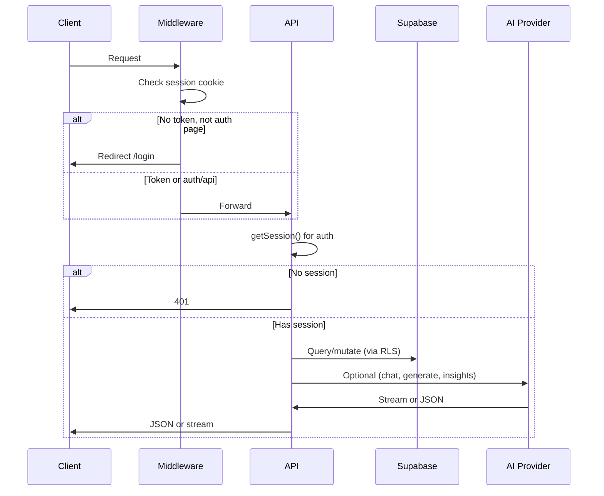
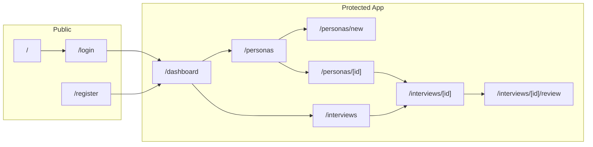

# Architecture

## Overview

TofuOS is a Next.js 16 App Router application. Authenticated users create professional personas (from templates, manually, via AI, deep research, or LinkedIn), start interviews with them, conduct real-time streaming chat, and export conversations. All app API routes require a valid session; auth is handled by Supabase Auth.

## Tech Stack

| Layer | Technology |
|-------|------------|
| Framework | Next.js 16 (App Router, Turbopack) |
| Language | TypeScript |
| Database | Supabase (PostgreSQL + RLS) |
| Auth | Supabase Auth (email/password, JWT session) |
| AI | Vercel AI SDK v6 (`ai`, multi-provider: `@ai-sdk/openai`, `@ai-sdk/google`, `@ai-sdk/anthropic`) |
| Styling | Tailwind CSS v4 (CSS variables for theming) |
| Package manager | pnpm |

## AI Provider Abstraction

The app supports multiple AI providers via a single configuration point in `src/lib/ai.ts`:

```
AI_PROVIDER=openai|google|anthropic    (default: openai)
AI_MODEL=<model-id>                    (optional override)
```

Provider defaults:
- **OpenAI**: `gpt-4o-mini`
- **Google**: `gemini-2.5-flash`
- **Anthropic**: `claude-sonnet-4-5-20250514`

All API routes call `getModel()` from `src/lib/ai.ts` — no route has a direct provider dependency. Switching providers requires only env var changes.

## Request Flow



## App Layout Structure



## Key Architectural Decisions

1. **Supabase (PostgreSQL + RLS)** — Managed Postgres with Row Level Security. No separate ORM or migration tool beyond raw SQL files in `supabase/migrations/`. Auth is handled by Supabase Auth (email/password provider, JWT tokens).

2. **Cookie-based middleware auth** — Middleware cannot make server-side Supabase calls on Edge Runtime. So middleware only inspects cookie presence for route protection; actual session validation happens in API routes.

3. **Streaming chat** — Client uses AI SDK `useChat` with `DefaultChatTransport`; server uses `streamText` and returns `toUIMessageStreamResponse()`. The client sends messages in UIMessage format (with `parts`); the server converts them to standard `{ role, content }` via `extractText` and `toStandardMessages` before calling the AI provider.

4. **Multi-provider AI** — `src/lib/ai.ts` exports `getModel()` which reads `AI_PROVIDER` and returns the appropriate provider instance. All AI SDK functions (`streamText`, `generateText`) are provider-agnostic. Retry logic (`withRetry`) handles quota/rate-limit errors across all providers.

5. **Export ZIP** — JSZip `generateAsync({ type: "uint8array" })` and response body cast to `BodyInit` for Edge/compatibility; avoid `nodebuffer`.

## Directory Structure

| Path | Purpose |
|------|--------|
| `src/app/` | App Router: pages, layouts, API routes |
| `src/app/(app)/` | Protected app routes (dashboard, personas, interviews); shared layout with nav |
| `src/app/(auth)/` | Login and register pages |
| `src/app/api/` | API route handlers |
| `src/components/` | Reusable components (e.g. `providers.tsx`); `chat/`, `personas/`, `ui/` subfolders |
| `src/lib/` | AI config, Supabase client, prompts, persona templates |
| `src/types/` | Type extensions |
| `supabase/` | SQL migrations |
| `public/` | Static assets |

## Data Flow Summary

- **Personas**: Created via POST `/api/personas` (or from templates/AI/deep-research/LinkedIn). `systemPrompt` is built from persona fields in `src/lib/prompts.ts` (`buildPersonaSystemPrompt`) unless provided.
- **Interviews**: Created via POST `/api/interviews` with `personaId`. Chat is POST `/api/chat` with `interviewId` and `messages`; messages are persisted and streamed response is returned.
- **Insights**: POST `/api/insights` with `interviewId` runs AI analysis over the transcript, returns structured JSON, and stores it on the interview record.
- **Export**: POST `/api/export` with `interviewIds` and optional `format`; returns single file (md/json/csv) or ZIP of multiple interviews plus `summary.json`.
