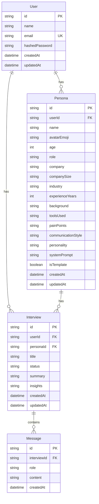

# Database Schema

Source of truth: `prisma/schema.prisma`. Database: SQLite.

## Entity Relationship



## Models

### User

- **id**: CUID, primary key
- **name**, **email** (unique), **hashedPassword**
- **createdAt**, **updatedAt**
- Relations: `personas`, `interviews`

### Persona

- **id**: CUID, primary key
- **userId**: FK to User (cascade delete)
- **name**, **avatarEmoji** (default `"👤"`), **age** (optional), **role**, **company**, **companySize**, **industry**, **experienceYears** (optional)
- **background**, **toolsUsed**, **painPoints**, **communicationStyle**, **personality** (all optional text)
- **systemPrompt**: Required; used as the system prompt for chat (built from other fields if not provided)
- **isTemplate**: Boolean, default false
- **createdAt**, **updatedAt**
- Index: `userId`
- Relations: `user`, `interviews`

### Interview

- **id**: CUID, primary key
- **userId**: FK to User (cascade delete)
- **personaId**: FK to Persona (cascade delete)
- **title**, **status** (default `"active"`), **summary**, **insights** (optional; insights often JSON string)
- **createdAt**, **updatedAt**
- Indexes: `userId`, `personaId`
- Relations: `user`, `persona`, `messages`

### Message

- **id**: CUID, primary key
- **interviewId**: FK to Interview (cascade delete)
- **role**: `"user"` or `"assistant"`
- **content**: Full message text
- **createdAt**
- Index: `interviewId`
- Relation: `interview`

## Migrations

- Create a new migration after changing `schema.prisma`:
  ```bash
  pnpm prisma migrate dev --name descriptive_name
  ```
- Apply existing migrations (e.g. production):
  ```bash
  pnpm prisma migrate deploy
  ```
- Regenerate the client after schema or migration changes:
  ```bash
  pnpm prisma generate
  ```

Prisma client is generated under `src/generated/prisma`. Import from `@/generated/prisma/client`.
